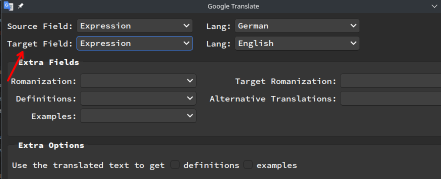

# Anki-english-sentence-deleter
An efficient program that quickly classifies and deletes English Anki cards from a dataset of 50,000 cards in under 2 minutes.

# Why did I need this program

I created this program because I accidentally set the target field for translation to be the same as the source, effectively wiping out the German content I needed. To fix this issue and clean up my Anki card collection efficiently, I developed a program capable of swiftly identifying and removing non-English cards from a substantial dataset of 50,000 cards in less than 2 minutes.

# Development Journey
1. Discovery of [Lingua](https://github.com/pemistahl/lingua-rs):
    While working on a different project, I discovered the Lingua library.

2. Creating a Node.js Scraper:
    Initially, I created a web scraper for my Anki collection using [Anki Connect](https://github.com/FooSoft/anki-connect) and Node.js. I chose Node.js because I believed that using Rust would require defining every field for the response object(later found out I was wrong).
    Encountered issues: My program kept crashing due to not specifying the query to be of the same type(as I am writing this I realize I could have just did ``if(note.field == undefined) continue;)`` or the TypeScript ``?``.
    Resorting to single requests: To resolve the issue, I decided to send one request per card, resulting in processing 50,000 cards, which took 15-30 minutes.

3. Rust Implementation:

    - I imported the JSON data into Rust and broke it down into chunks of 10,000.

    - Multi-threading for classification: I assigned each thread to classify each card using Lingua, achieving near-instantaneous results.
        - Used Arc<T> which allows a reference to be available in multiple threads with the caveat being you can't mutate the data. Which was super for me. Since I didn't need to mutate only get the sentence.
        - I collected the data using mpsc

4. Rewriting the Scraper in Rust:

    - Recognizing the need for efficiency, I decided to rewrite my scraper in Rust. This time, I optimized the query to retrieve only notes of the same type. Chunked requests: I broke down the requests into 10 chunks of 10,000, further improving the program's performance.
    - Seing the async kewyord got me intrested what is the point when I am calling await and my code is running synchrnously. Discovered about ``future join!`` eventually ended up using ``JoinSet`` I have no idea if it's actually faster. But it was fun trying to write.
